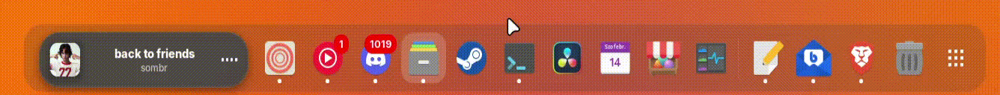
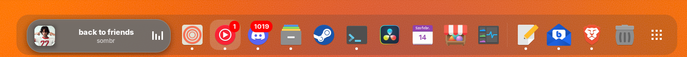
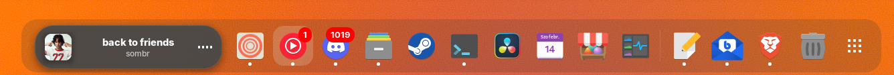

**Dynamic Music Pill 🎵**

A "Dynamic Island" inspired, adaptive music widget for GNOME Shell (45+).

This extension displays the currently playing media in a sleek, pill-shaped widget in the Dash or Top Panel, complete with album art colors, animations, and controls.

**Get it on**

Note: This is my first GNOME extension project! Feedback, code reviews, and contributions are highly welcome.

**Features**

 Adaptive UI: Background color transitions dynamically based on the average color of the current album art.

 Universal Skip Lock: Prevents UI flickering during track changes (3s grace period) – works with keyboard, mouse, and dock controls.

 Smart Player Switching: Automatically prioritizes the active music source (e.g., switches from Spotify to YouTube seamlessly).

 Control: You can Resume/Pause the music by clicking it, or skip it with the mouse scroll.

 Scrolling Text: Long titles and artists scroll smoothly (can be toggled in settings).

 Visual Polish: Blur effects, smooth slide animations, and waveform visualization.

**📸 Screenshots**

Active / Playing

Paused

**🛠 Installation**

From Source (GitHub)

Clone the repository:
`
git clone https://github.com/Andbal23/dynamic-music-pill.git]
`
`
cd dynamic-music-pill
`

Build and Install:
You need to compile the schemas and move the files to your extensions folder.
`
# Create the directory
`
mkdir -p ~/.local/share/gnome-shell/extensions/dynamic-music-pill@andbal
`

# Copy files
`
cp -r * ~/.local/share/gnome-shell/extensions/dynamic-music-pill@andbal/
`

# Compile schemas
`
cd ~/.local/share/gnome-shell/extensions/dynamic-music-pill@andbal
glib-compile-schemas schemas/
`

Restart GNOME Shell:

X11: Press Alt + F2, type r, and hit Enter.

Wayland: Log out and log back in.

Enable the extension:
Use the "Extensions" app or run:
`
gnome-extensions enable dynamic-music-pill@andbal
`

**⚙️ Configuration**

You can customize the extension via the Extensions app (or Extension Manager):

Scrolling Text: Toggle the automatic text scrolling for long titles.

Position: Choose between placing the pill above the Dock or in the Top Panel.

More settings coming soon!

**🐛 Known Issues & Limitations**

Since this is an initial release (v1.0), please keep in mind:

Structure: The codebase is currently monolithic (extension.js contains most logic). I plan to refactor this into modules.

Dash Support: Optimized primarily for Dash to Dock or for the basic Dash.

**🚀 Roadmap**

[ ] Refactor code into separate classes/modules.

[ ] Improve positioning logic for default GNOME shell.

[ ] Compatibility with Dash to Panel and the Top Panel.

[ ] Long term: Explore replacing the actual app icon in the dock with the pill.

**🤝 Contributing**

I welcome contributions! If you have ideas on how to improve the architecture or implement new features (like the icon replacement), feel free to open a Pull Request or an Issue.
**
License: GPL-3.0**
