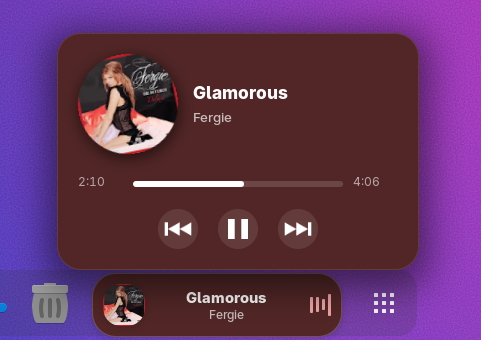
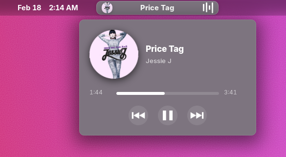
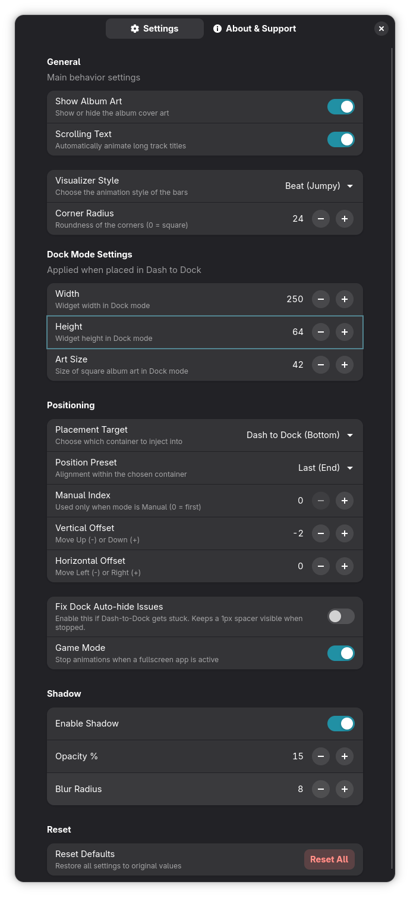

<table align="center"> <tr> <td align="center" style="border: none !important;">  </td> <td align="center" style="border: none !important;"> <h1 style="margin: 0; font-size: 45px;">Dynamic Music Pill</h1> </td> </tr> </table>
A dynamic, elegant, and highly customizable music widget for GNOME Shell. It brings a pill-shaped media controller with a live waveform visualizer directly to your Dash or Panel with a Pop-Up Menu.
  

  
    

---

  
   
   

---
## ✨ Features

* **Dual Placement:** Supports both **Dash** and the **Panel** (Left, Center, and Right sections).
* **Pop-Up Menu:** You can seek into the track from the Pop-Up Menu and more.
* **Adaptive Colors:** The widget's background and visualizer colors automatically adapt to the current track's album art.
* **Live Visualizer:** Real-time waveform or beat animation that reacts to your music.
* **🎮 Game Mode:** Automatically stop the visual and the scrolling when a fullscreen application is active to ensure maximum performance (FPS).
* **Smart Scrolling:** Long titles and artist names scroll smoothly to stay readable.
* **Customization:** Fine-tune width, height, offsets, corner radius, and shadow effects independently for both Dock and Panel modes. You can also enable or disable album art.
* **Controls:** You can skip or resume the media by clicking it or scroll for skip or rewind.

---

### 📸 Screenshots

| Dash-to-Dock Integration | Top Panel Mode |
|:---:|:---:|
|  |  |

| Pop-Up Dash | Pop-Up Panel |
|:---:|:---:|
|  |  |

### 🎬 Preview

  

---
## 🌐 From GNOME Extensions Store

  
  

---

# 🚀 Installation

##  Manual Installation
From Source (GitHub)

## **1.** Clone the repository:

`
 git clone https://github.com/Andbal23/dynamic-music-pill.git 
`
## **2.** Go into the directory
`
cd dynamic-music-pill
`

## **3.** Create the directory
`
mkdir -p ~/.local/share/gnome-shell/extensions/dynamic-music-pill@andbal
`

## **4.** Copy files
`
cp -r * ~/.local/share/gnome-shell/extensions/dynamic-music-pill@andbal/
`

## **5.** Compile schemas
`
cd ~/.local/share/gnome-shell/extensions/dynamic-music-pill@andbal
`
 
`
glib-compile-schemas schemas/
`

## **6.**  Restart GNOME Shell 
(`Alt+F2`, type `r`, then `Enter`) or log out/in if you are on Wayland.
## **7.**  Enable the extension 
via **GNOME Extensions** or **Extension Manager** or `gnome-extensions enable dynamic-music-pill@andbal`

---
# 💬 Manual Translation Installation (for GitHub Clones, Release)

If you are installing this extension by cloning the repository manually, the translation files (`.po`) must be compiled into binary files (`.mo`) for GNOME Shell to recognize them.

### 1. Prerequisites
Ensure you have the **gettext** package installed on your system:

* **Ubuntu/Debian:** `sudo apt install gettext`
* **Fedora:** `sudo dnf install gettext`
* **Arch:** `sudo pacman -S gettext`

### 2. Compile Translations
Run the following commands in the extension's root directory to enable your preferred language:

| Language | Flag | Command |
| :--- | :---: | :--- |
| **Hungarian** | 🇭🇺 | `mkdir -p locale/hu/LC_MESSAGES && msgfmt po/hu.po -o locale/hu/LC_MESSAGES/dynamic-music-pill.mo` |
| **German** | 🇩🇪 | `mkdir -p locale/de/LC_MESSAGES && msgfmt po/de.po -o locale/de/LC_MESSAGES/dynamic-music-pill.mo` |
| **French** | 🇫🇷 | `mkdir -p locale/fr/LC_MESSAGES && msgfmt po/fr.po -o locale/fr/LC_MESSAGES/dynamic-music-pill.mo` |
| **Spanish** | 🇪🇸 | `mkdir -p locale/es/LC_MESSAGES && msgfmt po/es.po -o locale/es/LC_MESSAGES/dynamic-music-pill.mo` |
| **Portuguese (BR)** | 🇧🇷 | `mkdir -p locale/pt_BR/LC_MESSAGES && msgfmt po/pt_BR.po -o locale/pt_BR/LC_MESSAGES/dynamic-music-pill.mo` |
| **Russian** | 🇷🇺 | `mkdir -p locale/ru/LC_MESSAGES && msgfmt po/ru.po -o locale/ru/LC_MESSAGES/dynamic-music-pill.mo` |
| **Italian** | 🇮🇹 | `mkdir -p locale/it/LC_MESSAGES && msgfmt po/it.po -o locale/it/LC_MESSAGES/dynamic-music-pill.mo` |

### 3. Restart GNOME Shell
After compilation, restart the shell to apply the changes:
* **X11:** Press `Alt+F2`, type `r`, and hit `Enter`.
* **Wayland:** Log out and log back in.
---
# Help Translate!

I want to make **Dynamic Music Pill** available to everyone in their native language! If you'd like to help translate the extension, you can easily do so via our translation platform. No coding skills required!

### How to contribute:
1. Click the badge below to visit the translation page.
2. Sign in with your GitHub account.
3. Start translating the strings!

---

## 🛠️ Configuration

Open the **Settings** to customize the appearance:
* **Position Mode:** Choose between Manual Index, Start, Center, or End alignment.
* **Visualizer Style:** Toggle between "Wave" (smooth) or "Beat" (energetic) modes.
* **Target Container:** Switch between Dock and Top Panel instantly.
* **Customize the look:** Height, width, offstets, border radius and more.
* **Album art** You can turn it off or on.
---

  

---

## Stars

  ---
## 📜 License

This project is licensed under the GPL-3.0 License.

---

  Made with ❤️ for the GNOME community.

